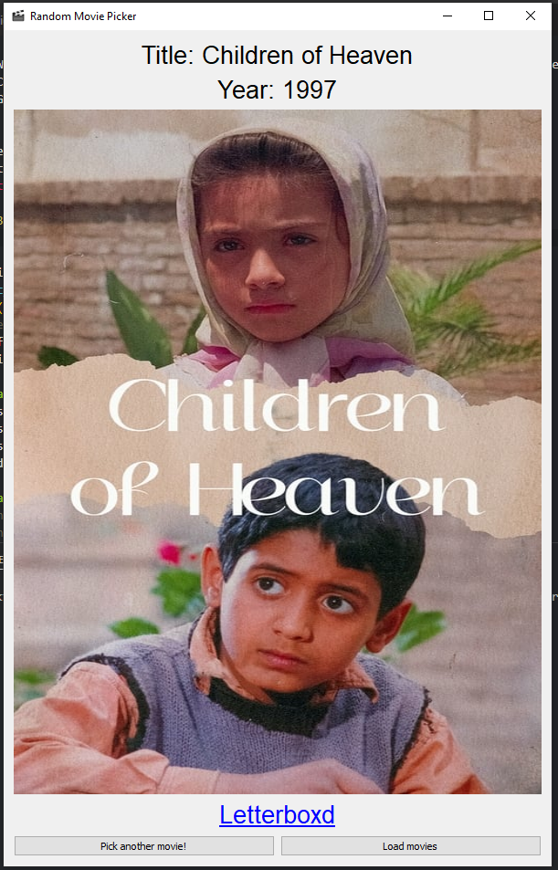
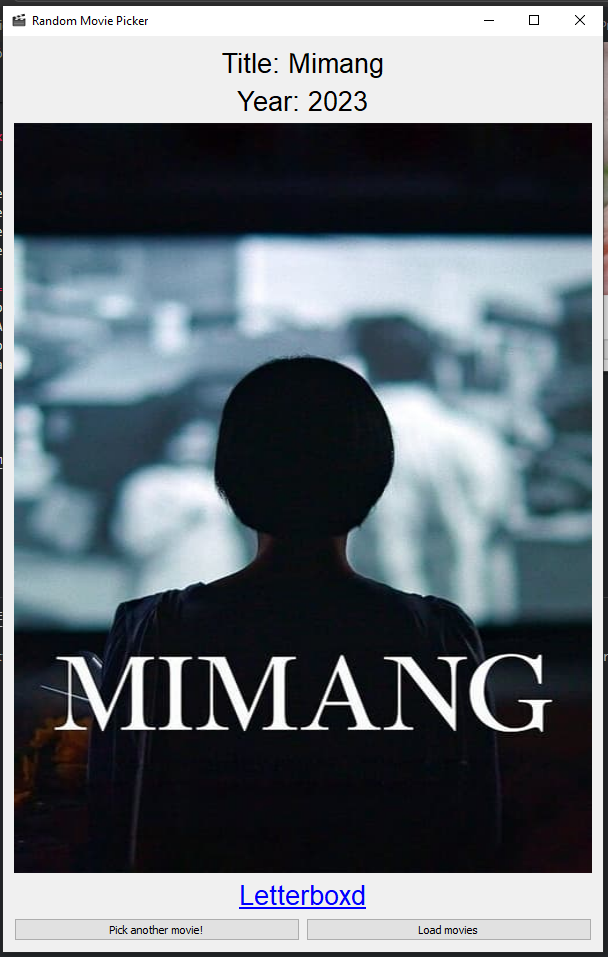
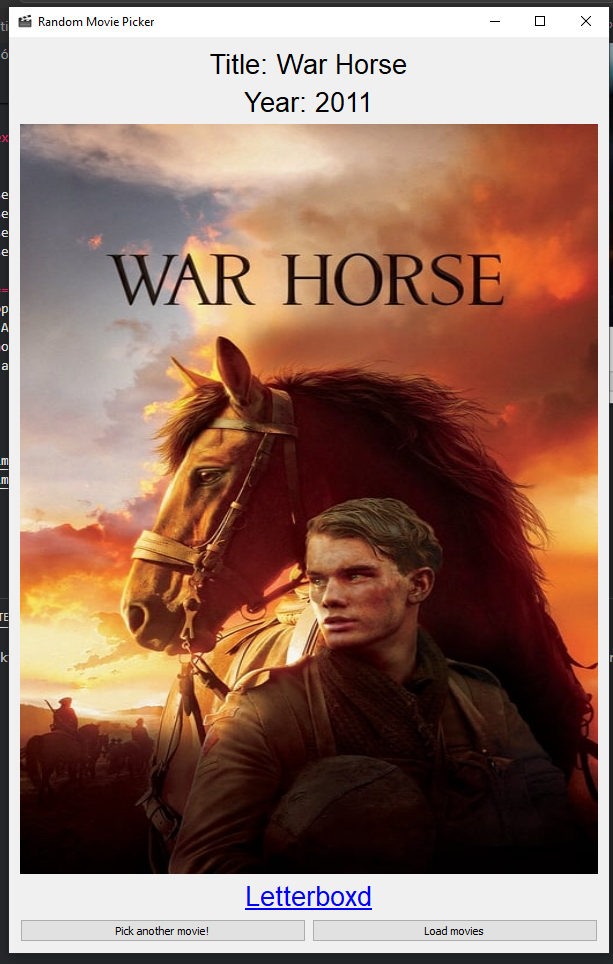

# Random Movie Picker

Una aplicación que selecciona aleatoriamente una película de una lista, muestra su información y su póster utilizando PyQt5, pandas y la API de The Movie DB.

- [Descripción](#descripción)
- [Instalación](#instalación)
- [Uso](#uso)
- [Módulos](#módulos)
  - [getposter.py](#getposterpy)
  - [main.py](#mainpy)
- [Ejecución](#ejecución)

## Descripción

Esta aplicación permite al usuario cargar un archivo CSV con una lista de películas, seleccionar una película al azar y mostrar detalles como el título, el año y un póster de la película usando la API de The Movie DB.

## Instalación

Sigue estos pasos para instalar y configurar el proyecto:

1. Clona el repositorio:
   ```bash
   git clone https://github.com/christian-munoz-rdz/random_movie_picker.git
   cd random-movie-picker
    ```

2. Crea un entorno virtual (opcional pero recomendado):

```bash
python -m venv env
source env/bin/activate  # En Windows usa `env\Scripts\activate`
```

3. Instala las dependencias:

```bash
pip install -r requirements.txt
```
# Uso 

Para iniciar la aplicación, asegúrate de tener un archivo CSV en el directorio raíz con una lista de películas. el archivo proviene de un watchlist de [Letterboxd](https://letterboxd.com/) y de ejecutar el programa en el entorno virtual.


```bash
python main.py
```

# Módulos
## getposter.py

Este módulo contiene la función get_movie_poster que obtiene el póster de una película utilizando la API de The Movie DB.

```python	
import requests

def get_movie_poster(api_key, movie_title):
    search_url = f"https://api.themoviedb.org/3/search/movie?api_key={api_key}&query={movie_title}"
    search_response = requests.get(search_url)
    search_data = search_response.json()

    if search_data['results']:
        movie_id = search_data['results'][0]['id']
        details_url = f"https://api.themoviedb.org/3/movie/{movie_id}?api_key={api_key}"
        details_response = requests.get(details_url)
        details_data = details_response.json()
        poster_path = details_data.get('poster_path')
        if (poster_path):
            poster_url = f"https://image.tmdb.org/t/p/w500{poster_path}"
            return poster_url
        else:
            return "No se encontró póster para esta película."
    else:
        return "No se encontraron resultados para esta búsqueda."
```

## main.py

Este módulo contiene la interfaz de usuario y la lógica principal de la aplicación utilizando PyQt5.

```python
from PyQt5.QtWidgets import QApplication, QLabel, QPushButton, QWidget, QFileDialog, QMessageBox, QHBoxLayout, QVBoxLayout
from PyQt5.QtCore import Qt
from PyQt5.QtGui import QFont, QIcon, QPixmap
import pandas as pd
import sys
from getposter import get_movie_poster
import requests
from io import BytesIO

api_key = "YOUR_API_KEY"

class Aplicacion(QWidget):
    def __init__(self):
        super(Aplicacion, self).__init__()
        self.file_open = False
        self.initialize()

    def initialize(self):
        self.setGeometry(200, 200, 600, 600)
        self.setWindowTitle("Random Movie Picker")
        self.setWindowIcon(QIcon("movie.ico"))
        self.displayWidgets()

    def displayWidgets(self):
        self.btn_pick = QPushButton(self)
        self.btn_pick.resize(200, 100)
        self.btn_pick.move(100, 350)
        self.btn_pick.setText("Pick a movie!")
        self.btn_pick.clicked.connect(self.pickMovie)

        self.btn_load = QPushButton(self)
        self.btn_load.resize(200, 100)
        self.btn_load.move(350, 350)
        self.btn_load.setText("Load movies")
        self.btn_load.clicked.connect(self.loadMovies)

        hlyt_buttons = QHBoxLayout()
        hlyt_buttons.addWidget(self.btn_pick)
        hlyt_buttons.addWidget(self.btn_load)

        self.title_label = QLabel(self)
        self.title_label.setAlignment(Qt.AlignCenter)
        self.year_label = QLabel(self)
        self.year_label.setAlignment(Qt.AlignCenter)
        self.url_label = QLabel(self)
        self.url_label.setAlignment(Qt.AlignCenter)
        self.title_label.resize(600, 200)
        self.year_label.resize(600, 200)
        self.url_label.resize(600, 200)
        self.title_label.move(50, 50)
        self.year_label.move(50, 120)
        self.url_label.move(50, 190)
        self.title_label.setWordWrap(True)
        self.pixmapLabel = QLabel(self)
        self.pixmapLabel.resize(150, 200)
        self.pixmapLabel.setAlignment(Qt.AlignCenter)

        vlyt_principal = QVBoxLayout()
        vlyt_principal.addWidget(self.title_label)
        vlyt_principal.addWidget(self.year_label)
        vlyt_principal.addWidget(self.pixmapLabel)
        vlyt_principal.addWidget(self.url_label)
        vlyt_principal.addLayout(hlyt_buttons)
        self.setLayout(vlyt_principal)

    def loadMovies(self):
        file_name = QFileDialog.getOpenFileName(self,"Abrir archivos", "../../", "CSV(*.csv)")
        if file_name[0] == "":
            QMessageBox.warning(self, "Advertencia", "No ha seleccionado ningun archivo")
        else:
            QMessageBox.information(self, "Datos cargados", "Datos cargados correctamente")
            self.movies_df = pd.read_csv(file_name[0])
            self.file_open = True

    def pickMovie(self):
        if self.file_open == False:
            QMessageBox.warning(self, "Advertencia", "No hay datos cargados")
        else:
            random_movie = self.movies_df.sample()
            titulo = random_movie['Name'].iloc[0]
            ano = int(random_movie['Year'].iloc[0])
            url = random_movie['Letterboxd URI'].iloc[0]
            self.title_label.setText(f"Title: {titulo}")
            self.title_label.setFont(QFont('Arial', 20))
            self.year_label.setText(f"Year: {ano}")
            self.year_label.setFont(QFont('Arial', 20))
            try:
                poster_url = get_movie_poster(api_key, titulo)
                response = requests.get(poster_url)
                if response.status_code == 200:
                    image_data = BytesIO(response.content)
                    pixmap = QPixmap()
                    pixmap.loadFromData(image_data.getvalue())
                    self.pixmapLabel.setPixmap(pixmap)
                    self.pixmapLabel.setScaledContents(True)
            except:
                pass

            self.url_label.setText(f"<a href='{url}'>Letterboxd</a>")
            self.url_label.setFont(QFont('Arial', 20))
            self.url_label.setOpenExternalLinks(True)
            self.btn_pick.setText("Pick another movie!")

if __name__ == '__main__':
    app = QApplication(sys.argv)
    window = Aplicacion()
    window.show()
    sys.exit(app.exec_())
```

#Ejecución




